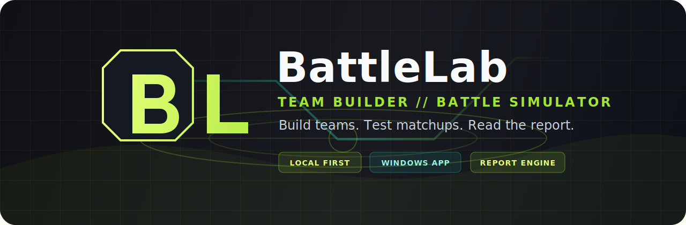

# BattleLab



Local-first competitive Pokemon team builder and battle simulator built for fast testing, clean reports, and polished desktop workflows.


## About

BattleLab is a standalone desktop app concept for building competitive Pokemon teams, running local battle simulations, and reviewing readable matchup reports without a hosted account or VPS.

- Designed around responsive, interactive, and polished UI.
- Focused first on the Battle Simulator and report experience.
- Built to keep team testing local to the user's machine.
- Planned around clear data contracts before backend simulation wiring.
- Inspired by clean report UX, visual feedback, and practical competitive analysis.

## Current Focus

The current milestone is a frontend-only pre-simulation shell using mock data and local session state. The app now focuses on clear Team Builder workflows, guided simulation setup, report review, Theater previews, Settings, and Catalog Update boundaries before any runtime or persistence work begins.

| Area | Goal |
| --- | --- |
| App Shell | Create the main desktop-style layout, sidebar, and status footer. |
| Team Builder | Build six editable Pokemon slots with filled and empty states. |
| Editor Panel | Edit fake catalog Pokemon with moves, ability, item, nature, Tera type, and stats. |
| Reports | Show saved simulation history with filters and report detail navigation. |
| Overview Report | Recreate the Champion-style overview with win rate, archetype bars, weaknesses, and strategy tips. |
| Theater | Preview sample replay cards and static matchups while playback remains unwired. |
| Catalog Update | Show fake catalog readiness while keeping Pokemon Showdown as the legality source of truth. |

## Current Checkpoint

- Frontend app scaffolded under `app/` with React, TypeScript, and Vite.
- Desktop-style shell, sidebar navigation, header actions, shared panel host, scrim, and blur behavior are in place.
- Team Builder supports local editing, clearing, Pokemon Showdown-style import/export, session save feedback, and guided simulation settings.
- Pokemon editor, Reports list, Report Detail Overview, Theater shell, Settings, and Catalog Update render from local fake data.
- Clear frontend boundaries are visible for disabled loading, local-only saves, sample replay previews, catalog data, and Showdown legality.
- Simulation, persistence, Electron packaging, PDF export, live catalog sync, and Theater playback are intentionally not wired yet.

## Planned Features

- Six-Pokemon team builder
- Pokemon Showdown-style team import/export
- Champion-format simulation reports
- Local report history
- Animated matchup graphs
- Threat, lead, core, and coverage views
- Defensive coverage matrix
- Local PDF report export
- PC performance profiles
- Future EV optimizer mode

## Tech Stack

**Core App**  


**Local Data & Runtime**  


**Tools**  


## Roadmap

| Phase | Goal | Status |
| --- | --- | --- |
| Phase 0 | Project structure and planning | Complete |
| Phase 1 | Frontend rough draft | Complete |
| Phase 1.5 | Pre-simulation frontend shell | In progress |
| Phase 2 | Catalog data architecture | Planned |
| Phase 3 | Local simulation proof | Planned |
| Phase 4 | Desktop wrapper | Planned |
| Phase 5 | Report export | Planned |

## Project Direction

BattleLab starts with the interface first, then moves into simulation wiring after the report shape and local app workflow are stable.

The intended long-term flow:

```text
Build team -> choose settings -> run simulation -> review report -> export paper report
```

## Disclaimer

BattleLab is an unofficial fan-made tool. This project is not affiliated with, endorsed by, sponsored by, or approved by Nintendo, Game Freak, The Pokemon Company, or Pokemon Showdown.

Pokemon names, move names, item names, and related intellectual property belong to their respective owners.
